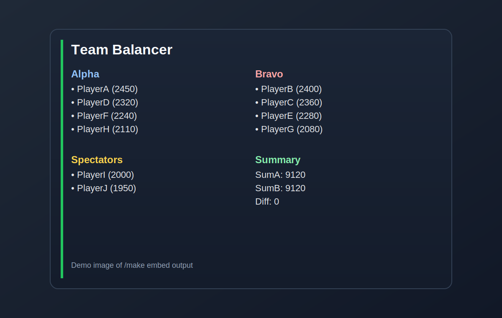

# Splatoon3 プライベートマッチ チーム分けBot

このBotは、プラベ参加者が `/join xpower` で集まったら、チーム合計Xパワー差が最小になるように 4v4 を自動で作ります。9〜10人でもそのまま使え、観戦を自動で選びつつ次試合の編成まで回せます。

## /make Embed デモ



---

## Quickstart

### 1) 環境変数

```bash
export DISCORD_TOKEN=your_token
export DISCORD_APP_ID=123456789012345678
export DISCORD_GUILD_ID=123456789012345678
export SQLITE_PATH=./data.db
```

### 2-A) ローカル実行（Go）

```bash
go run cmd/bot/main.go
```

### 2-B) Docker実行（DB永続化）

```bash
docker build -t splatoon-team-balancer-bot .
docker run --rm \
  -e DISCORD_TOKEN="$DISCORD_TOKEN" \
  -e DISCORD_APP_ID="$DISCORD_APP_ID" \
  -e DISCORD_GUILD_ID="$DISCORD_GUILD_ID" \
  -e SQLITE_PATH=/data/db.sqlite \
  -v "$(pwd)/data:/data" \
  splatoon-team-balancer-bot
```

---

## 最短導線（まずこれだけ）

1. 全員が `/join xpower` で参加
2. `/make` で初回チーム分け
3. 試合ごとに `/next` で次編成

補助:

- もう一回抽選したい: `/reroll`
- 直前に戻したい: `/undo`
- 自分の状態確認: `/whoami`

---

## よくある運用例

### トイレ・来客で数試合抜けたい

```text
/pause matches:3 reason:トイレ
```

復帰したら:

```text
/resume
```

### 誤操作した / ひとつ前に戻したい

```text
/undo
```

---

## 10人参加時の挙動

- 常に 8人を選んで 4v4 を作成
- 残りは観戦（10人なら2人、9人なら1人）
- 観戦ローテーションを考慮して連続観戦を減らす

---

## 困ったとき

- 使い方を出す: `/help`
- 部屋状態を確認（管理者のみ）: `/diagnose`

コマンドが出ないときのチェック:

1. Botを招待したサーバーで実行しているか
2. `DISCORD_APP_ID` / `DISCORD_GUILD_ID` が正しいか
3. Bot招待時に `applications.commands` 権限があるか
4. Bot再起動後、数十秒待ってDiscordクライアントを開き直す

---

## 主要コマンド

- `/join xpower` 参加/更新
- `/leave` 退出
- `/list` 参加者一覧
- `/make` 初回チーム分け
- `/next` 次試合を作成
- `/pause` `/resume` `/paused` 一時離脱運用
- `/undo` 直前状態へ復元
- `/result winner:(alpha|bravo)` 勝敗記録
- `/settings show|set` 部屋設定（setは管理者）
- `/export` 履歴/統計を出力
- `/reset` 部屋リセット（管理者）

---

## 技術者向けドキュメント

- [TECH](docs/TECH.md)
- [Architecture](docs/ARCHITECTURE.md)
- [Decisions](docs/DECISIONS.md)
- [Releasing](docs/RELEASING.md)
- [Changelog](CHANGELOG.md)
- [License (MIT)](LICENSE)

